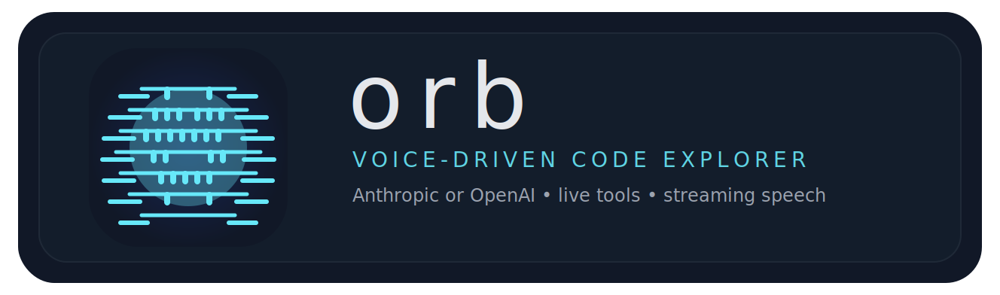
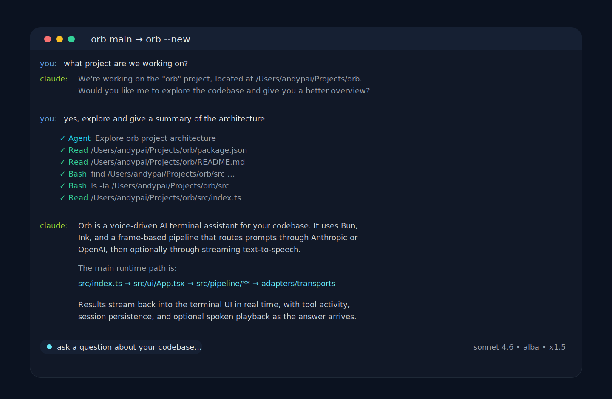

<p align="center">
  
</p>

<p align="center">
  Voice-driven code explorer for your terminal. Ask questions about your codebase, watch tool calls live, and optionally hear answers spoken aloud while they stream.
</p>

<p align="center">
  
</p>

## Why Orb

Orb is a Bun-native terminal app for exploring real codebases with Anthropic, OpenAI/Codex, or Gemini models. It keeps the interface focused, shows tool activity as it happens, remembers project conversations, and can read answers aloud through `tts-gateway` or macOS `say`.

## Features

- **Natural language queries** - Ask questions about your code in plain English
- **Live tool activity** - See file reads, shell commands, and exploration steps as they happen
- **Voice input friendly** - Paste transcriptions from MacWhisper for hands-free interaction
- **Streaming TTS (serve mode)** - Hear answers while they are still being generated
- **Provider selection** - Choose Anthropic (Claude), OpenAI/Codex, or Gemini via CLI flags
- **Model switching** - Cycle provider model choices during a conversation with Shift+Tab
- **Session history & resume** - Keeps recent conversations per project; auto-resumes the latest, or pick any past session with `orb sessions` / `/sessions`
- **Slash command prompts** - Expand `/explain`-style shortcuts from project or global Markdown files
- **Focused terminal UI** - Ink-based interface with conversation history, tool activity, and the Orb intro

## Installation

### Global install

```bash
# With Bun
bun install -g @andypai/orb

# With npm (Bun is still required at runtime)
npm install -g @andypai/orb
```

### Local / one-off use

```bash
# Run without installing globally
bunx @andypai/orb

# Add to a Bun project
bun add @andypai/orb

# npm also works, but Bun is still required at runtime
npm install @andypai/orb
```

## 60-Second Quick Start

### 1. Set up an LLM provider

- Anthropic: sign in with Claude Code / Max, or set `ANTHROPIC_API_KEY`
- OpenAI: sign in with Codex / ChatGPT subscription auth (`codex login --device-auth`)
- Gemini: set `GOOGLE_GENERATIVE_AI_API_KEY`

If you do not pass `--provider` or `--model`, Orb auto-selects a provider in this order:

1. Codex CLI signed in with ChatGPT
2. Claude Agent SDK (Claude Code / Max or API key)
3. `GOOGLE_GENERATIVE_AI_API_KEY`
4. `ANTHROPIC_API_KEY`

### 2. Pick your speech path

#### Fastest path with no speech

```bash
orb --no-tts
```

#### Fastest path on macOS (batch speech)

```bash
orb --tts-mode=generate
```

Generate mode uses macOS built-ins (`say` and `afplay`) and does not require `tts-gateway`.

#### Recommended path for streaming speech

```bash
uv tool install tts-gateway[kokoro]
~/.local/share/uv/tools/tts-gateway/bin/python -m spacy download en_core_web_sm
tts serve --provider kokoro --port 8000
```

That spaCy install is important: Kokoro’s first request will crash in a plain `uv tool` install unless `en_core_web_sm` is installed into the `tts-gateway` tool environment.

Orb expects `tts-gateway` at `http://localhost:8000` by default. Batch speech uses
`POST /v1/speech`, and streaming playback uses `POST /tts/stream`.
For the lowest-latency stream playback, install `mpv` or `ffplay`.

### 3. Run Orb

```bash
# Explore the current directory
orb

# Guided setup for persistent defaults
orb setup

# Explore a specific project
orb /path/to/project
```

## Usage

```bash
# Anthropic with options
orb --model=sonnet --voice=marius
orb --provider=anthropic --model=opus

# OpenAI provider
orb --provider=openai --model=gpt
orb --model=openai:mini

# Gemini provider
orb --provider=gemini --model=pro
orb --model=gemini:flash-lite

# Fresh conversation
orb --new

# List saved sessions and resume one (interactive picker)
orb sessions

# Resume a specific saved session by id
orb /path/to/project --resume <session-id>

# Skip the intro animation
orb --skip-intro
```

### Options

| Option                        | Description                                                                                                 | Default                                                 |
| ----------------------------- | ----------------------------------------------------------------------------------------------------------- | ------------------------------------------------------- |
| `--provider=<provider>`       | LLM provider: `anthropic`\|`claude`, `openai`\|`gpt`\|`codex`, `gemini`\|`google` (alias: `--llm-provider`) | `auto`                                                  |
| `--model=<model>`             | Model ID or semantic alias (`haiku`, `sonnet`, `opus`, `gpt`, `mini`, `pro`, etc.) or `provider:model`      | `haiku` (anthropic), `gpt-5.5` (openai), `pro` (gemini) |
| `--reasoning-effort=<effort>` | OpenAI/Codex reasoning effort: `none`, `minimal`, `low`, `medium`, `high`, `xhigh`                          | `high`                                                  |
| `--voice=<voice>`             | TTS voice: `alba`, `marius`, `jean`                                                                         | `alba`                                                  |
| `--tts-mode=<mode>`           | `serve` for `tts-gateway`, `generate` for local macOS `say`                                                 | `serve`                                                 |
| `--tts-server-url=<url>`      | Serve-mode gateway URL                                                                                      | `http://localhost:8000`                                 |
| `--tts-speed=<rate>`          | TTS speed multiplier                                                                                        | `1.5`                                                   |
| `--resume-session=<ref>`      | Resume a provider session, using `claude:<session-id>` or `codex:<thread-id>`                               | -                                                       |
| `--resume=<id>`               | Resume a specific saved session by id (see `orb sessions`)                                                  | -                                                       |
| `--claude-session=<id>`       | Resume a Claude Code session by id                                                                          | -                                                       |
| `--codex-thread=<id>`         | Resume a Codex app-server thread by id                                                                      | -                                                       |
| `--new`                       | Start fresh (ignore saved session)                                                                          | -                                                       |
| `--skip-intro`                | Skip the welcome animation                                                                                  | -                                                       |
| `--no-tts`                    | Disable text-to-speech                                                                                      | -                                                       |
| `--no-streaming-tts`          | Disable streaming (batch mode)                                                                              | -                                                       |
| `--help`                      | Show help message                                                                                           | -                                                       |

### Controls

- Type your question and press **Enter** to submit
- Insert a new line with **Ctrl+J** or **Alt+Enter**
- Paste MacWhisper transcription with **Cmd+V**
- Press **Esc** or **Ctrl+S** to stop speech
- Press **Shift+Tab** to cycle resolved model choices
- Press **Ctrl+O** to toggle live tool-call details
- Press **Ctrl+C** to exit

### Slash Commands

Orb can expand slash-command prompts from Markdown files:

- Project-local commands: `<project>/.orb/commands/*.md`
- Global commands: `~/.orb/commands/*.md`
- If both exist, the project-local command wins
- Built-ins: `/help` explains slash commands, `/commands` lists everything available, and `/sessions` opens the saved-session picker to resume a past conversation

Example:

```bash
mkdir -p ~/.orb/commands
cat > ~/.orb/commands/explain.md <<'EOF'
Explain the relevant code clearly, call out the important moving parts, and keep the answer concise.
EOF
```

Then in Orb:

```text
/explain
/explain why is this failing?
```

Orb will load `explain.md`, and if you include trailing text it appends that text after a blank line. If a slash command is missing, Orb shows a turn-level error with the paths it checked.

Built-in commands:

```text
/help
/commands
/sessions
```

## TTS Setup

Orb supports two TTS paths:

- **Serve mode** (default): send speech requests to a local `tts-gateway` server
- **Generate mode**: use macOS built-in `say` for local fallback speech

### Serve mode

Serve mode gives Orb the best experience for low-latency streaming speech.
Orb streams from the gateway's `/tts/stream` endpoint when streaming TTS is enabled,
and falls back to the regular `/v1/speech` path for batch generation.

#### Install and start `tts-gateway`

```bash
uv tool install tts-gateway[kokoro]
~/.local/share/uv/tools/tts-gateway/bin/python -m spacy download en_core_web_sm
tts serve --provider kokoro --port 8000
```

#### Verify the server

```bash
curl http://localhost:8000/health
curl -X POST http://localhost:8000/v1/speech -F 'text=hello from orb' -o /tmp/orb-check.mp3
```

Then run Orb with defaults:

```bash
orb
```

For true streamed playback, install `mpv` or `ffplay` locally. If neither is available,
Orb falls back to saved-file playback where the local platform supports it.

If you use a different host or port:

```bash
orb --tts-server-url=http://localhost:9000
```

You can also save that value permanently with `orb setup` or `tts.server_url` in `~/.orb/config.toml`.

#### Voice notes

Orb exposes three portable voice presets: `alba`, `marius`, and `jean`.

Some `tts-gateway` providers use different internal voice names. Orb already retries once without an explicit voice if the gateway rejects a preset, so a working server default will still speak.

### Generate mode

On macOS, generate mode works out of the box with the built-in `say` command:

```bash
orb --tts-mode=generate
```

If you want advanced voices, non-macOS support, or streaming playback while the model is still responding, use serve mode with `tts-gateway` instead.

### Disable TTS

```bash
orb --no-tts
```

## Provider Setup

Orb supports three LLM providers: **Anthropic (Claude)**, **OpenAI via Codex**, and **Gemini**. On startup, Orb refreshes a cached model catalog from Vercel AI Gateway and resolves semantic aliases like `opus`, `gpt`, and `pro` to the newest matching native model ID for the selected runtime.

### Session handoff

Orb can take over an existing provider conversation when you have the provider's resumable id. This starts the Orb interface and reads future answers aloud while preserving backend conversation context.

```bash
# Continue an idle Claude Code session in Orb
orb --claude-session=17a921a9-c798-4ceb-8d1f-1ba89c8e9839 /path/to/project

# Equivalent generic form
orb --resume-session=claude:17a921a9-c798-4ceb-8d1f-1ba89c8e9839 /path/to/project

# Continue a Codex app-server thread in Orb
orb --codex-thread=019e188d-1e3e-73f0-986f-bbb7ca00d009 /path/to/project
orb --resume-session=codex:019e188d-1e3e-73f0-986f-bbb7ca00d009 /path/to/project
```

Use this after the other client is idle; do not drive the same Claude or Codex conversation from two terminals at once. The project path must match the original session's working directory. `--new` clears Orb's visible saved history but still honors the explicit handoff id.

### OpenAI (default)

OpenAI support uses `codex app-server`, so it can use your ChatGPT/Codex subscription instead of OpenAI Platform API billing.

#### Quick start

```bash
codex login --device-auth

# Uses OpenAI/Codex by default when ChatGPT auth is available
orb

orb --provider=openai
orb --provider=openai --model=gpt
orb --model=openai:mini
```

#### Model aliases

- `gpt-5.5` (default): mainline GPT 5.5 with high reasoning effort
- `gpt`: latest mainline GPT model from the model catalog
- `mini`: latest GPT mini model
- `nano`: latest GPT nano model
- `pro`: latest GPT pro model
- `codex`: latest GPT Codex model

> Note: OpenAI runs through Codex app-server. If `codex login status` reports API-key auth, log out and sign in with ChatGPT to use subscription access.

### Anthropic

Anthropic uses the Claude Agent SDK. Orb can reuse a local Claude Code / Max-authenticated session when available, or fall back to `ANTHROPIC_API_KEY` / `CLAUDE_API_KEY`.

#### Quick start

```bash
# Uses Anthropic by default when available
orb

# Explicitly specify Anthropic
orb --provider=anthropic

# Use model aliases
orb --model=haiku
orb --model=sonnet
orb --model=opus

# Or use a full model ID
orb --model=claude-haiku-4-5-20251001
```

#### Model aliases

- `haiku` (default): latest supported Claude Haiku model
- `sonnet`: latest Claude Sonnet model
- `opus`: latest Claude Opus model

If you are not already signed in through Claude Code / Max, set `ANTHROPIC_API_KEY` or `CLAUDE_API_KEY` before starting Orb.

For setup details, see the [Claude Agent SDK quickstart](https://platform.claude.com/docs/en/agent-sdk/quickstart) and the [Claude models overview](https://platform.claude.com/docs/en/about-claude/models/overview).

### Gemini

Gemini support uses the AI SDK Google provider and requires `GOOGLE_GENERATIVE_AI_API_KEY`.

#### Quick start

```bash
export GOOGLE_GENERATIVE_AI_API_KEY=...

orb --provider=gemini
orb --provider=gemini --model=pro
orb --model=gemini:flash-lite
```

#### Model aliases

- `pro` (default): latest Gemini Pro model
- `flash`: latest Gemini Flash model
- `flash-lite`: latest Gemini Flash Lite model

> Note: Gemini runs through Orb's owned `bash`, `readFile`, and `writeFile` tools backed by a local subprocess sandbox. `bash` starts in your project root by default, `readFile` can read absolute or project-relative paths, and `writeFile` applies changes directly inside the project root instead of to an overlay.

## Global Config

Persistent defaults live in `~/.orb/config.toml`. CLI flags override config values for one-off runs.

The easiest way to create the file is:

```bash
orb setup
```

A typical config looks like:

```toml
provider = "openai"
model = "gpt-5.5"
reasoning_effort = "high"
skip_intro = false

[tts]
enabled = true
streaming = true
mode = "serve"
server_url = "http://localhost:8000"
voice = "alba"
speed = 1.5
buffer_sentences = 1
clause_boundaries = false
min_chunk_length = 15
max_wait_ms = 150
grace_window_ms = 50
```

Config-only advanced tuning keys live under `[tts]`:

- `buffer_sentences`
- `clause_boundaries`
- `min_chunk_length`
- `max_wait_ms`
- `grace_window_ms`

Sessions are stored under `~/.orb/sessions/<project>/<session-id>.json`, keeping a
history of recent conversations per project (older ones are pruned). Orb auto-resumes
the latest on startup; use `orb sessions` (or `/sessions` in the app) to browse and
resume any saved conversation across projects.

## Customizing Prompts

Orb’s built-in instructions live in the root-level `prompts/` directory:

- `prompts/base.md` for shared behavior
- `prompts/anthropic.md` for Anthropic-specific system instructions
- `prompts/openai.md` for OpenAI/Codex-specific instructions
- `prompts/gemini.md` for Gemini-specific tool and sandbox instructions
- `prompts/voice.md` for voice-mode guidance added when TTS is enabled

Prompt files are read fresh for each run, so edits apply to the next question without rebuilding the app.

## Requirements

- **Runtime**: Bun >= 1.1
- **LLM provider**: Anthropic, Codex/OpenAI, or Gemini authentication
- **TTS** (optional): `tts-gateway` for serve mode, or macOS `say` and `afplay` for generate mode

## Development

```bash
git clone https://github.com/abpai/orb.git
cd orb
bun install

# Run in development
bun run dev

# Run with OpenAI
bun run dev --provider=openai --model=gpt

# Run with Gemini
bun run dev --provider=gemini --model=pro

# Checks
bun run check
bun run typecheck
bun run test
```

## License

MIT
